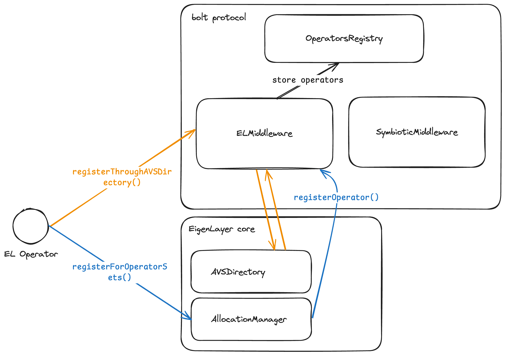

# bolt-registry contracts

## Overview

- [`OperatorsRegistryV1.sol`](./src/holesky/contracts/OperatorsRegistryV1.sol): The registry to keep track of all the operators and their associated metadata.
- [`BoltEigenLayerMiddlewareV1.sol`](./src/holesky/contracts/BoltEigenLayerMiddlewareV1.sol): The middleware contract for managing EigenLayer operators and strategies.
- [`BoltSymbioticMiddlewareV1.sol`](./src/holesky/contracts/BoltSymbioticMiddlewareV1.sol): The middleware contract for managing Symbiotic operators and vaults.

## Architecture

This is a simplified diagram to understand the architecture of the EigenLayer middleware and how it interacts with the OperatorsRegistry.

In short, when operators wish to opt-in to bolt, they need to register themselves in the `BoltEigenLayerMiddleware` for
the restaking protocol they wish to use. The middleware will then handle the protocol-specific logic, such as checking if the
operator is active and has the necessary permissions to opt-in.

For EigenLayer for instance, the operator can use the `registerForOperatorSets` function on the `AllocationManager` to register
to the bolt AVS. The middleware will then handle the `IAVSRegistrar.registerOperator()` callback and track the registration
in the `OperatorsRegistry`'s storage.

## Deployments

### Mainnet

Mainnet contracts are deployed at the following addresses:

| Name                                                                 | Proxy                                                                                                                      | Implementation                                                                                | Notes      |
| -------------------------------------------------------------------- | -------------------------------------------------------------------------------------------------------------------------- | --------------------------------------------------------------------------------------------- | ---------- |
| [OperatorsRegistryV1](./src/contracts/OperatorsRegistryV1.sol)       | [0x630869F51C012C797FEb3D9006F4280587C78b3f](https://etherscan.io/address/0x630869F51C012C797FEb3D9006F4280587C78b3f#code) | [0x0f2a...2d63](https://etherscan.io/address/0x0f2a3b9caea77ea58bfb42ea81c4292157122d63#code) | UUPS Proxy |
| [SymbioticMiddlewareV1](./src/contracts/SymbioticMiddlewareV1.sol)   | [0x74c4eF33fce5bbfDb786c65efca513C68C7d19C3](https://etherscan.io/address/0x74c4eF33fce5bbfDb786c65efca513C68C7d19C3#code) | [0x0aC0...5Bbe](https://etherscan.io/address/0x0aC0488aF24E9064F703a2263762Db26EdFc5Bbe#code) | UUPS Proxy |
| [EigenLayerMiddlewareV2](./src/contracts/EigenLayerMiddlewareV2.sol) | [0x35DebC00531Ac8771be5dbEf015feFD084efA958](https://etherscan.io/address/0x35DebC00531Ac8771be5dbEf015feFD084efA958#code) | [0x0843...45f0](https://etherscan.io/address/0x08433Fe6831F05bbeb42DefE27E353474F7845f0#code) | UUPS Proxy |

### Holesky

Holesky testnets contracts are deployed at the following addresses:

| Name                                                                 | Proxy                                                                                                                              | Implementation                                                                                        | Notes      |
| -------------------------------------------------------------------- | ---------------------------------------------------------------------------------------------------------------------------------- | ----------------------------------------------------------------------------------------------------- | ---------- |
| [OperatorsRegistryV1](./src/contracts/OperatorsRegistryV1.sol)       | [0x030ffdbb1e90ebfd763cfa7a7127ee055039e6ec](https://holesky.etherscan.io/address/0x030ffdbb1e90ebfd763cfa7a7127ee055039e6ec#code) | [0x8731...37f4](https://holesky.etherscan.io/address/0x8731e30074E2C665536A0aa6FCce4Ff8434D37f4#code) | UUPS Proxy |
| [SymbioticMiddlewareV1](./src/contracts/SymbioticMiddlewareV1.sol)   | [0x0696A10F54F387483c95F260bb09eEAcF041E9Ba](https://holesky.etherscan.io/address/0x0696A10F54F387483c95F260bb09eEAcF041E9Ba#code) | [0xE745...Cf26](https://holesky.etherscan.io/address/0xE74507aED3e67bb8acFc2aFcC4d1847685d9Cf26#code) | UUPS Proxy |
| [EigenLayerMiddlewareV1](./src/contracts/EigenLayerMiddlewareV1.sol) | [0x0bF214EaC2E3992Ff054fa8EAF1D13E84d45A885](https://holesky.etherscan.io/address/0x0bF214EaC2E3992Ff054fa8EAF1D13E84d45A885#code) | [0x7a71...eEC6](https://holesky.etherscan.io/address/0x7a71a782D1030d7a595d6E711a81139C2F8AeEC6#code) | UUPS Proxy |

<!-- links -->

[bolt]: https://boltprotocol.xyz
[bolt-gh]: https://github.com/chainbound/bolt
